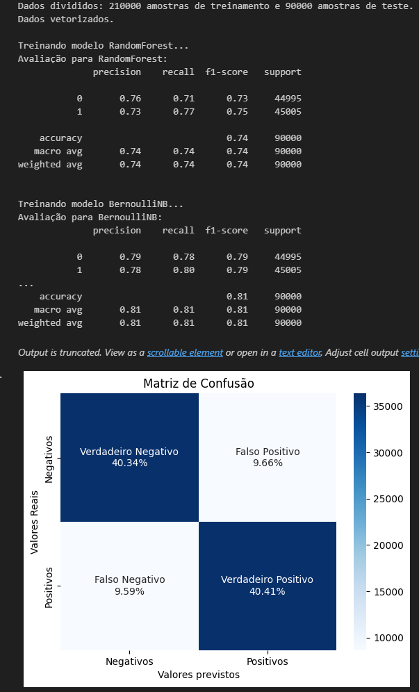

# Sentiment Analysis Agent

Este projeto tem como objetivo realizar uma análise de sentimento em tweets utilizando técnicas de processamento de linguagem natural e aprendizado de máquina. O modelo classifica os tweets em dois sentimentos: **Positivo** e **Negativo**.

## Requisitos

Antes de rodar o código, é necessário instalar as dependências abaixo:

```
pandas
numpy
nltk
sklearn
emoji
seaborn
```

## Como usar

### 1. Extrair o Dataset
O dataset foi compactado no formato .7z para possibilitar a disponibilização no GitHub e está nomeado como **tweetsDatasetReduced.7z**. O arquivo contém um conjunto de tweets classificados de acordo com seus respectivos sentimentos (positivo ou negativo). 
Para o correto funcionamento do código, é necessário extrair o arquivo utilizando qualquer ferramenta de descompactação como o 7-Zip e nomeá-lo de **tweetsDatasetReduced.csv** dentro da pasta da qual o arquivo **sentimentAnalysisAgent.ipynb** está.

### 2. Arquivo executável
Execute o notebook Jupyter (ipynb) para iniciar o processo de pré-processamento, treinamento e avaliação através da cédula e o resultado será gerado conforme exemplo abaixo:



## Estrutura do Projeto

```
SentimentAnalysisAgent/
├── README.md
├── Relatorio_Final.pdf
├── sentimentAnalysisAgent.ipynb
├── tweetsDatasetReduced.7z
└── tweetsDatasetReduced.csv (após descompactar)
```

## Resultados Esperados
Ao final do processo, você obterá a avaliação dos modelos de aprendizado de máquina para classificação de sentimento, além de uma matriz de confusão para o modelo Logistic Regression. Se preferir, é possível alterar a matriz escolhida renomeando **models["LogisticRegression"]** na linha **plot_confusion_matrix(models["LogisticRegression"], X_test, y_test)**:
```
"RandomForest"
"BernoulliNB"
"LinearSVC"
"LogisticRegression"
```

## Conclusão
Este projeto inicial utiliza aprendizado de máquina e técnicas de processamento de linguagem natural para realizar uma análise de sentimento em tweets. O código pode ser facilmente estendido para incluir mais modelos adicionando-o no bloco: 
```
models = {
        "RandomForest": RandomForestClassifier(n_estimators=200, max_depth=15, random_state=42),
        "BernoulliNB": BernoulliNB(alpha=2),
        "LinearSVC": LinearSVC(),
        "LogisticRegression": LogisticRegression(C=2, max_iter=1000, n_jobs=-1),
        (Adicione aqui um novo modelo)
    }
```
